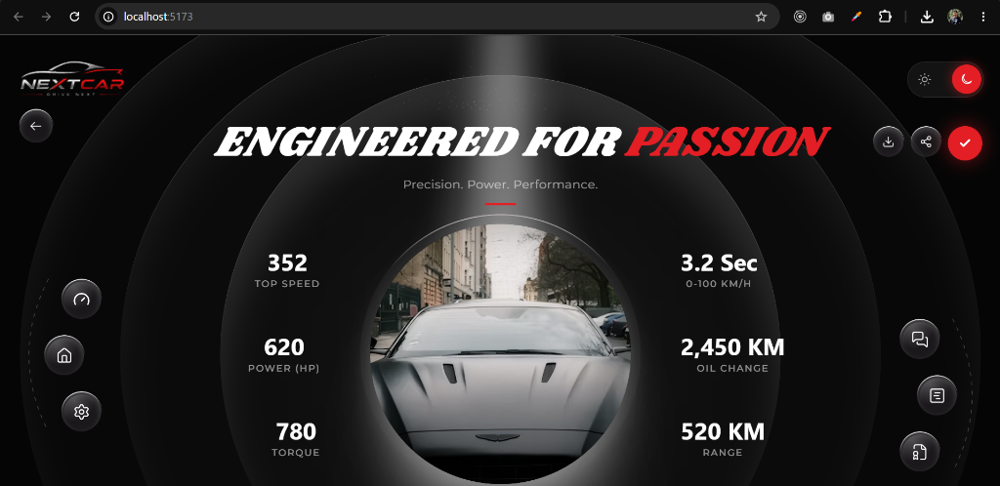
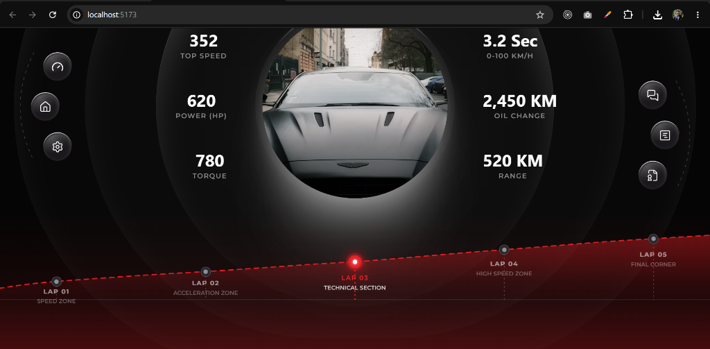
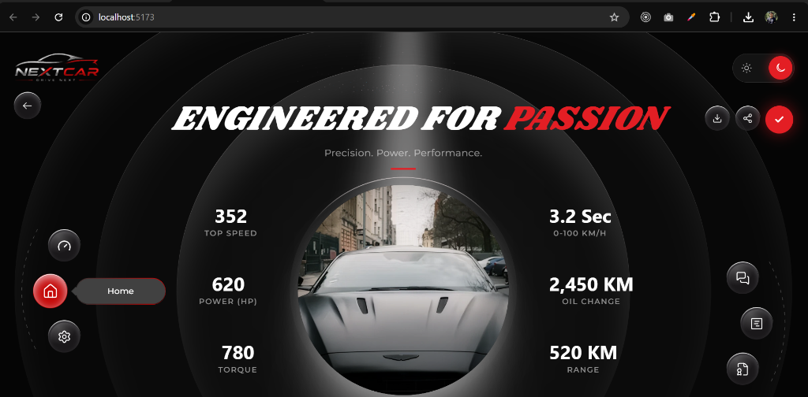
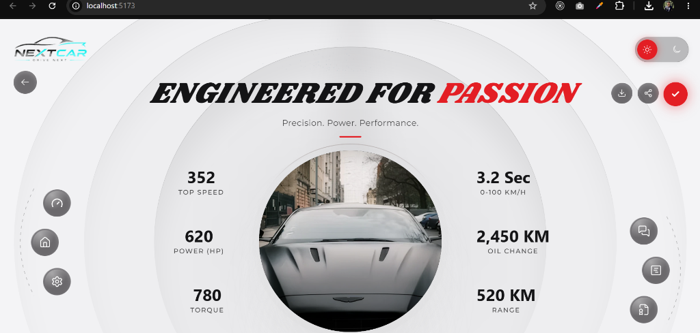
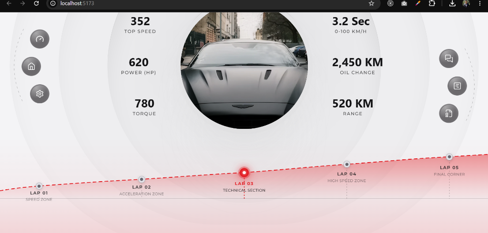

# NEXTCAR — Automotive Performance Dashboard

A pixel-perfect, highly responsive frontend implementation of the **NEXTCAR Automotive Performance Dashboard** design from Figma. Built with React, Vite, and Tailwind CSS v4 featuring light/dark theme switching, fluid telemetry graph visualization, and custom SVG icon systems.

---

## 📸 Visual Demonstration & Screenshots

### 1. Dark Mode Dashboard (Default)


### 2. Full-Width Telemetry Graph (Dark Mode)


### 3. Interactive Navigation & Hover Tooltip


### 4. Light Mode Dashboard


### 5. Full-Width Telemetry Graph (Light Mode)


---

## 🚀 How to Run the Project

### 1. Prerequisites
Ensure you have **Node.js (v18+)** and **npm** installed on your system.

### 2. Installation
Clone the repository and install project dependencies:
```bash
# Clone the repository
git clone https://github.com/saini-saini/raman-frontend-assignment.git
cd raman-frontend-assignment

# Install dependencies
npm install
```

### 3. Running in Development Mode
Start the Vite local development server:
```bash
npm run dev
```
Open your browser and navigate to **[http://localhost:5173](http://localhost:5173)**.

### 4. Production Build & Verification
To build the production bundle and preview it locally:
```bash
# Build for production
npm run build

# Preview production build locally
npm run preview
```

---

## 🛠️ Tech Stack Used

| Category | Tech / Tool | Description |
|---|---|---|
| **Core Framework** | **React 19** | Component-driven UI architecture with hooks and custom context |
| **Build Tool & Bundler** | **Vite 6** | Ultra-fast HMR dev server and production asset bundling |
| **Styling & Design System** | **Tailwind CSS v4** | Utility-first CSS styling using `@import 'tailwindcss'`, `@theme` CSS tokens, and custom variants |
| **Typography** | **Google Fonts** | `Shrikhand` (italic display title) & `Montserrat` (clean geometric body) |
| **State Management** | **React Context API** | ThemeContext for persistent Light/Dark theme switching |
| **Graphics & Icons** | **SVG & HTML5 Canvas** | Custom inline vector icons and 100% full-width telemetry SVG graph curve |

---

## 💡 Assumptions & Design Decisions Made

1. **Pixel-Close Figma Fidelity & Asset Optimization:**
   - Extracted exact high-definition car cutout graphics, vector assets, spotlight overlays, and sparkles background overlays from Figma.
   - Hand-crafted all 14+ vector SVG icons (`Home`, `Meter`, `Settings`, `Chat`, `Documents`, `Certificate`, `Download`, `Share`, `Back`, `Check`) matching exact Figma viewBox dimensions and stroke widths.

2. **100% Full-Width Telemetry Graph (`LapTimeline.jsx`):**
   - Designed the red dashed telemetry curve line, gradient glow fill, and horizontal baseline to span **100% edge-to-edge screen width** across all devices.
   - Distributed lap markers (LAP 01 to LAP 05) fluidly across percentage-based coordinates (`8%`, `29%`, `50%`, `71%`, `92%`).

3. **Background Concentric Circles Responsiveness:**
   - Maintained concentric Figma background rings centered directly around the car showcase.
   - On screens below `769px` / `450px`, the rings dynamically adjust sizes and positions to ensure zero scrollbar overflow and perfect visual alignment behind the car.

4. **Theme Persistence & Z-Index Architecture:**
   - Implemented `ThemeContext` storing the user's preference in `localStorage` and toggling `.dark` class on the `document.documentElement` root.
   - Positioned the `ThemeToggle` pill directly in the top header (`TopBar.jsx`) at `z-50` for instantaneous click feedback on mobile, tablet, and desktop viewports.

5. **Hover Interaction Standards:**
   - Navigation buttons display a dark glass appearance by default (`premium-icon-btn`), turning **Racing Red (`bg-racing-red`)** with red glow highlights exclusively on user hover.

---

## 📁 Project Structure

```
raman-frontend-assignment/
├── public/
│   └── screenshots/         # Working visual demonstration screenshots
├── src/
│   ├── assets/              # High-res image assets (car cutout, spotlight, sparkles, logo)
│   ├── components/          # Reusable UI components
│   │   ├── BackgroundEffects.jsx   # Concentric rings & spotlight beams
│   │   ├── CarImage.jsx            # Central car showcase with glow effects
│   │   ├── FloatingControls.jsx    # Action buttons (Download, Share, Back)
│   │   ├── HeroSection.jsx         # Hero title + car + stats grid layout
│   │   ├── HeroTitle.jsx           # Display typography ("ENGINEERED FOR PASSION")
│   │   ├── Icons.jsx               # Vector SVG icon collection
│   │   ├── LapTimeline.jsx         # Edge-to-edge 100% telemetry graph timeline
│   │   ├── RightControls.jsx       # Layout helper
│   │   ├── SideNavigation.jsx      # Arc-guided side nav & mobile bottom bar
│   │   ├── StatsPanel.jsx          # Performance metrics panels
│   │   ├── ThemeToggle.jsx         # Sun/Moon theme switch pill
│   │   └── TopBar.jsx              # Responsive header with logo & theme toggle
│   ├── context/
│   │   └── ThemeContext.jsx        # Light/Dark theme provider & persistence
│   ├── data/
│   │   └── dashboardData.js        # Performance metrics, laps, and navigation data
│   ├── pages/
│   │   └── Dashboard.jsx           # Main dashboard container
│   ├── App.jsx
│   ├── main.jsx
│   └── index.css                   # Tailwind v4 directives & custom CSS tokens
├── index.html
├── package.json
├── vite.config.js
└── README.md
```

---

## 🎨 Figma & Repository References
- **Working Repository:** [saini-saini/raman-frontend-assignment](https://github.com/saini-saini/raman-frontend-assignment)
- **Figma Design:** [Frontend Assignment Figma Design](https://www.figma.com/design/ri2lwqcK23HHjebpMMUQkY/Frontend-Assignment)
